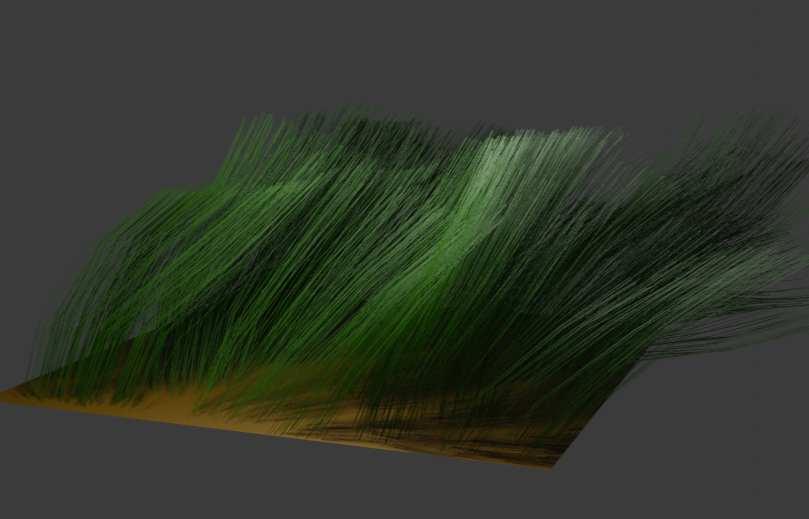

# Blender and GIMP plug-ins

## Grass animation (Blender)

This addon allows for the generation of grass and its animation.

### Installation Instructions

- 1) Download Blender version 3.4.0 or newer.
- 2) Download the plug-in.
- 3) Open Blender and go to `Edit -> Preferences -> Addons` and install the plugin (the .py file).
- 4) A new panel named 'Grass' will appear on the right side of the 3D scene editor.

### Testování

* Linux

Navigate to the `tests` directory and run the following command in the terminal: `blender --background --python 3dTest.py`.

* Windows

Find where the Python interpreter for Blender is located (typically C:\Program Files\Blender Foundation\Blender <version>\blender.exe).
Then, run the following command in cmd: `"path\to\blender.exe" --background --python "path\to\3dTest.py"`.

## Edge detection (GIMP)

This addon allows for edge detection on images based on selected parameters.

### Postup instalace

- 1) Download GIMP version 2.10.38 or newer.
- 2) Download the plug-in.
- 3) Open GIMP and go to `Edit -> Preferences -> Folders -> Plug-ins`
- 4) Save the plugin (the .py file) to the first directory in the list.
- 5) Restart GIMP.
- 6) In the menu `Filters` will appear option `Convolution`

### Testování

* Windows

Unfortunately, it does not work on Windows or it is too difficult to set up. :(

* Linux

Navigate to the `tests` directory and run the following command: `gimp -i -b '(python-fu-2dTest RUN-NONINTERACTIVE)' -b '(gimp-quit 0)'`

